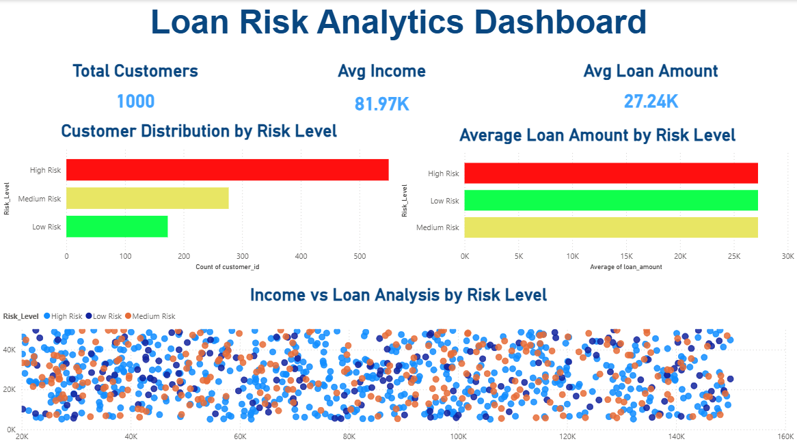

# 📊 Loan Risk Analytics Dashboard

## 🔍 Project Overview

This project analyzes customer financial data to identify loan risk patterns using SQL and Power BI.

## 🛠 Tools Used

* MySQL
* Power BI

## 📊 Key Features

* Designed relational database (customers, financials, loans)
* Used SQL joins and window functions
* Created risk classification based on credit score
* Built interactive Power BI dashboard

## 📈 Key Insights

* High-risk customers have lower credit scores
* Loan amount varies with income
* Risk segmentation helps decision-making

## 🚀 Conclusion

This project demonstrates SQL, data analysis, and visualization skills.

